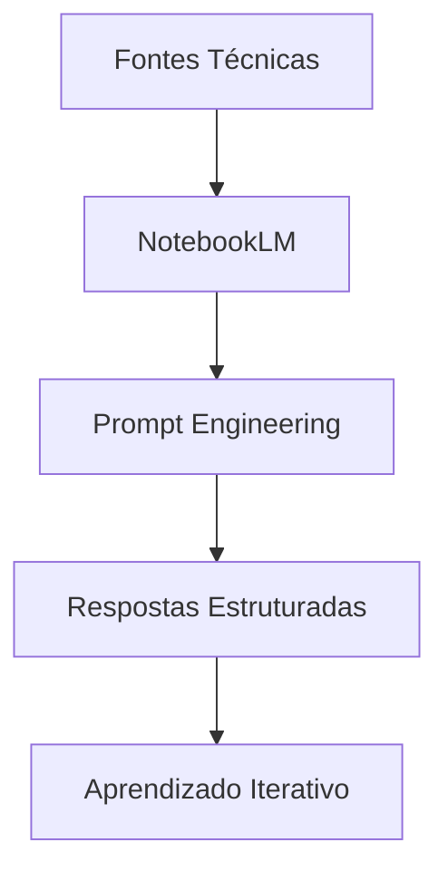
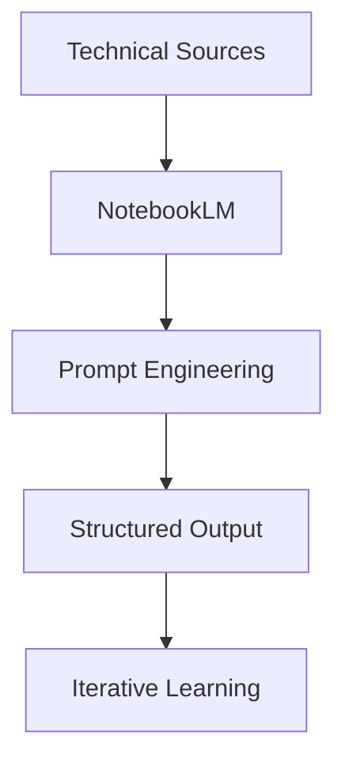

# 🧠 AI Engineering Training System

### NotebookLM aplicado à formação de Engenheiro de IA

<p align="center">
  
  
  
  
</p>

---

## 🇧🇷 PT-BR

## 📌 Visão Geral

Este projeto demonstra a aplicação do **NotebookLM como um sistema de treinamento em Engenharia de IA**, utilizando curadoria de conteúdo técnico e técnicas avançadas de interação com modelos de linguagem.

O objetivo não é apenas utilizar IA, mas **estruturar, controlar e otimizar seu comportamento**, como um engenheiro faria.

---

## 🎯 Objetivo

Construir um ambiente onde a IA:

* Atue como mentor técnico
* Ensine conceitos avançados
* Proponha exercícios
* Corrija respostas
* Simule cenários reais

---

## 🧠 Arquitetura do Conhecimento



---

## ⚙️ Tecnologias e Conceitos

* Prompt Engineering
* LLM (Large Language Models)
* RAG (Retrieval Augmented Generation)
* Controle de Alucinação
* Segurança em IA

---

## 🧪 Testes de Engenharia de Prompt

### 🔹 Prompt Genérico

```text
Explique prompt engineering
```

➡️ Resultado: resposta superficial

---

### 🔹 Prompt Estruturado

```text
Explique prompt engineering como um engenheiro de IA, com exemplos práticos e exercício aplicado
```

➡️ Resultado: resposta técnica e aplicável

---

### 📊 Comparação

| Critério          | Genérico | Estruturado |
| ----------------- | -------- | ----------- |
| Profundidade      | ❌        | ✅           |
| Clareza           | ❌        | ✅           |
| Aplicação prática | ❌        | ✅           |

---

## 📘 Aprendizados

* A qualidade da IA depende diretamente do prompt
* Restrições reduzem alucinação
* Contexto melhora drasticamente as respostas
* Iteração é essencial

---

## 📂 Estrutura do Projeto

```bash
.
├── README.md
└── docs/
    └── prompt-tests.md
```

---

## 🚀 Conclusão

O projeto demonstra que a IA pode ser transformada em um **sistema de aprendizado ativo**, quando corretamente estruturada com engenharia de prompt e curadoria de conhecimento.

---

## 🇺🇸 ENGLISH

## 📌 Overview

This project demonstrates how **NotebookLM can be used as an AI Engineering training system**, using curated technical content and advanced prompt engineering techniques.

The goal is not just to use AI, but to **structure, control, and optimize its behavior**.

---

## 🎯 Objective

Build an environment where AI:

* Acts as a technical mentor
* Teaches advanced concepts
* Provides exercises
* Corrects answers
* Simulates real-world scenarios

---

## 🧠 Knowledge Architecture



---

## ⚙️ Technologies & Concepts

* Prompt Engineering
* LLM (Large Language Models)
* RAG
* Hallucination Control
* AI Security

---

## 🧪 Prompt Engineering Tests

### 🔹 Basic Prompt

```text
Explain prompt engineering
```

➡️ Result: shallow response

---

### 🔹 Structured Prompt

```text
Explain prompt engineering as an AI engineer, including practical examples and exercises
```

➡️ Result: deep and practical response

---

### 📊 Comparison

| Criteria      | Basic | Structured |
| ------------- | ----- | ---------- |
| Depth         | ❌     | ✅          |
| Clarity       | ❌     | ✅          |
| Practical Use | ❌     | ✅          |

---

## 📘 Key Learnings

* Output quality depends on prompt quality
* Constraints reduce hallucinations
* Context improves responses
* Iteration is critical

---

## 🚀 Conclusion

This project shows how AI can be transformed into an **active learning system** through structured prompt engineering and curated knowledge.

---
