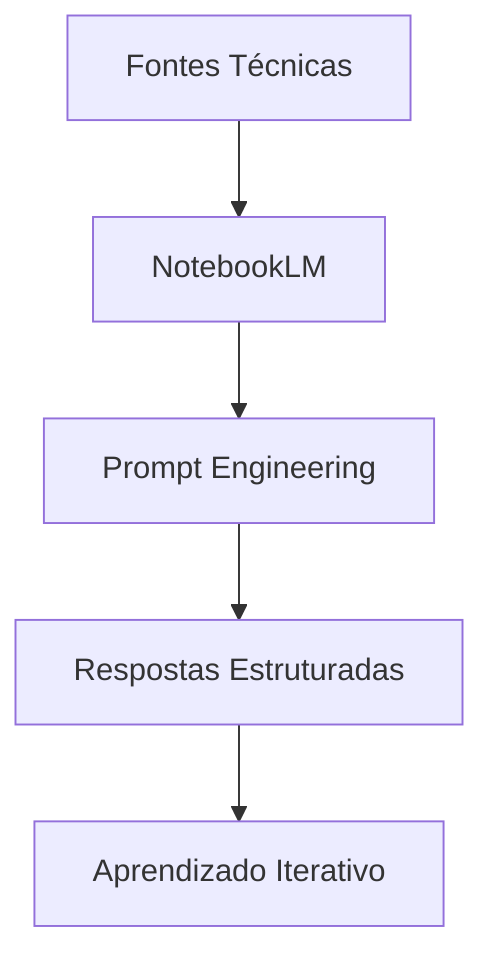
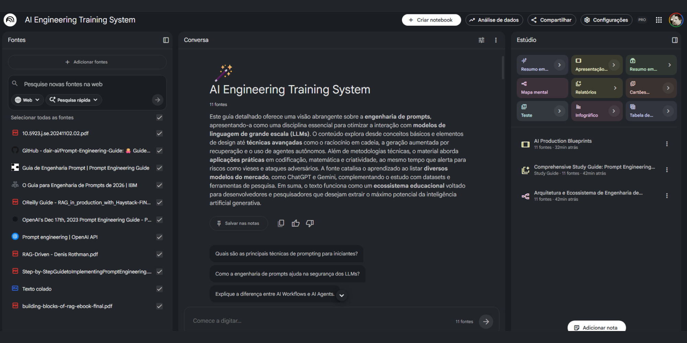
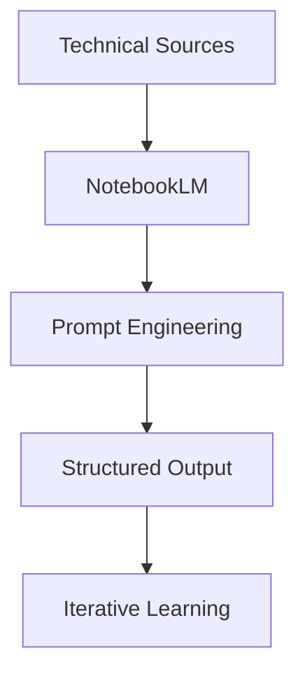

# AI Engineering Training System

### NotebookLM applied to AI Engineering training

> Structured AI Engineering project focused on Prompt Engineering, RAG and controlled LLM behavior.

<p align="center">
  
  
  
  
</p>

---

## PT-BR

## Visão Geral

Este projeto demonstra a aplicação do NotebookLM como um sistema estruturado de treinamento em Engenharia de IA, utilizando curadoria de conteúdo técnico e técnicas avançadas de interação com modelos de linguagem.

O foco não é apenas utilizar IA, mas estruturar, controlar e otimizar seu comportamento de forma profissional.

---

## Objetivo

Construir um ambiente onde a IA:

* Atue como mentor técnico
* Ensine conceitos avançados
* Proponha exercícios
* Corrija respostas
* Simule cenários reais

---

## Arquitetura do Conhecimento



---

## Tecnologias e Conceitos

* Prompt Engineering
* LLM (Large Language Models)
* RAG (Retrieval Augmented Generation)
* Controle de alucinação
* Segurança em IA

---

## Testes de Engenharia de Prompt

### Prompt Genérico

```text
Explique prompt engineering
```

Resultado: resposta superficial, sem aplicação prática.

---

### Prompt Estruturado

```text
Explique prompt engineering como um engenheiro de IA, com exemplos práticos e exercício aplicado
```

Resultado: resposta técnica, estruturada e com aplicação prática.

---

### Conclusão

A estrutura do prompt impacta diretamente a qualidade das respostas. Prompts bem definidos aumentam precisão, profundidade e aplicabilidade.

---

## Evidence

### NotebookLM Interaction




---

### Knowledge Base (Sources)


---

## Estrutura do Projeto

```bash
.
├── README.md
├── docs/
│   └── prompt-tests.md
└── assets/
```

---

## Detalhamento dos Testes

O detalhamento completo dos testes pode ser encontrado em:

docs/prompt-tests.md

---

## Conclusão

Este projeto demonstra como a IA pode ser utilizada de forma estruturada para aprendizado técnico, aplicando princípios de engenharia de prompt e curadoria de conhecimento.

---

## ENGLISH

## Overview

This project demonstrates how NotebookLM can be used as a structured AI Engineering training system, using curated technical content and advanced prompt engineering techniques.

The goal is not just to use AI, but to structure, control, and optimize its behavior.

---

## Objective

Build an environment where AI:

* Acts as a technical mentor
* Teaches advanced concepts
* Provides exercises
* Corrects answers
* Simulates real-world scenarios

---

## Knowledge Architecture



---

## Technologies & Concepts

* Prompt Engineering
* LLM (Large Language Models)
* RAG
* Hallucination Control
* AI Security

---

## Prompt Engineering Tests

### Basic Prompt

```text
Explain prompt engineering
```

Result: shallow response.

---

### Structured Prompt

```text
Explain prompt engineering as an AI engineer, including practical examples and exercises
```

Result: structured and practical response.

---

## Conclusion

Prompt structure directly impacts output quality. Well-designed prompts produce more reliable and useful responses.

---
