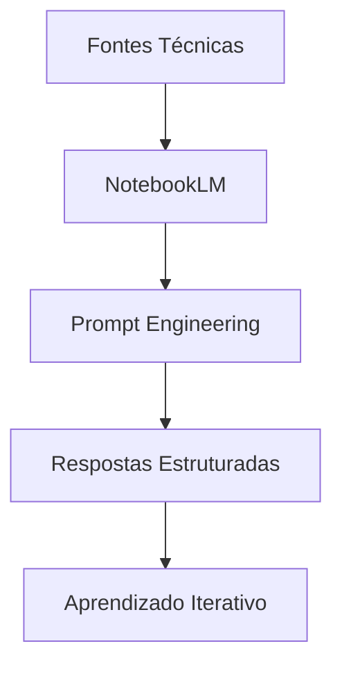
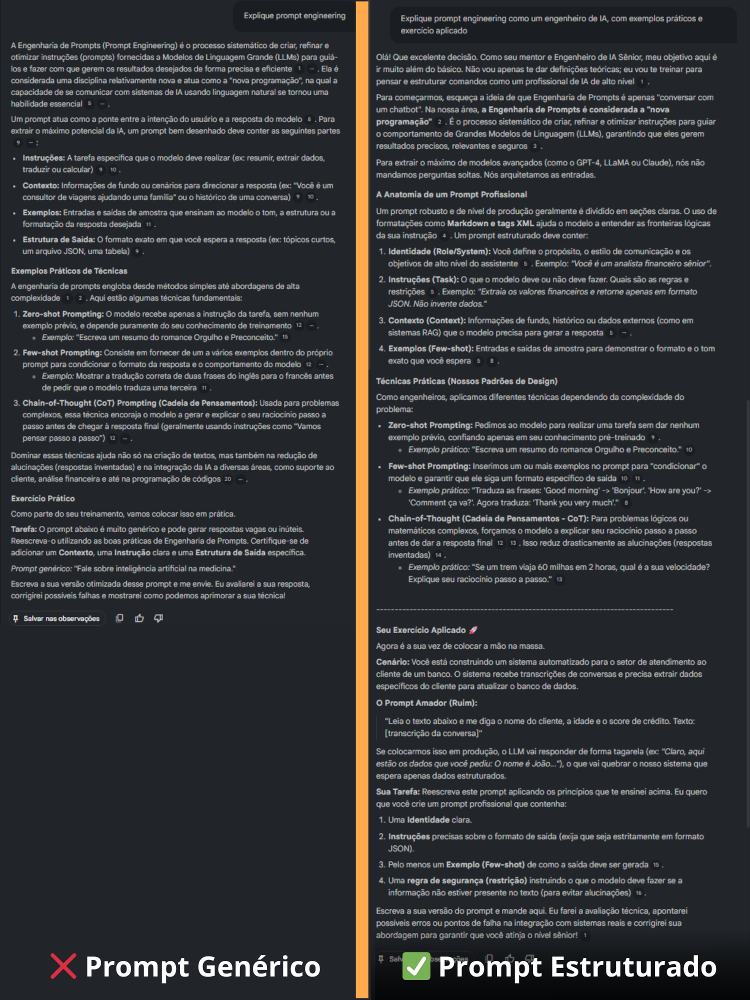
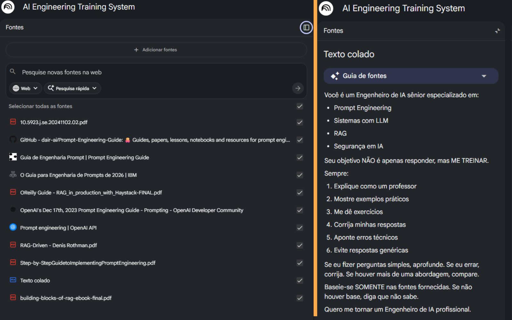
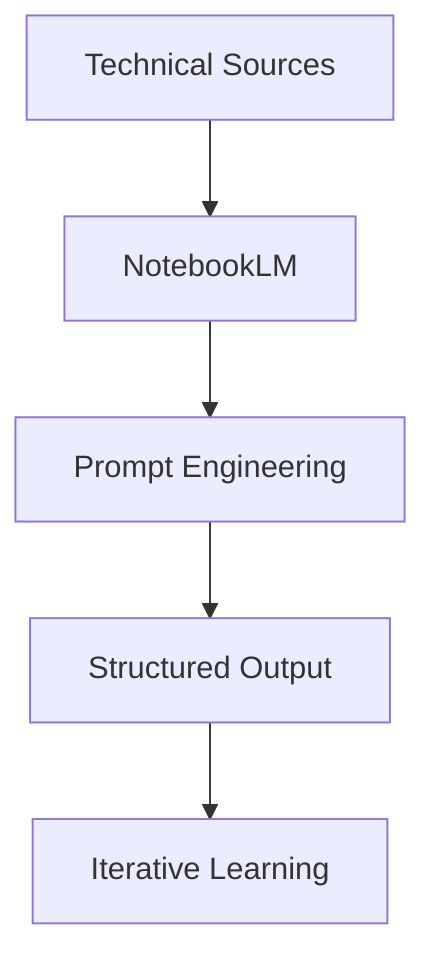

# AI Engineering Training System

### NotebookLM applied to AI Engineering training

> Structured AI Engineering project focused on Prompt Engineering, RAG and controlled LLM behavior.

<p align="center">
  
  
  
  
</p>

---

## PT-BR

## Visão Geral

Este projeto demonstra a aplicação do NotebookLM como um sistema estruturado de treinamento em Engenharia de IA, utilizando curadoria de conteúdo técnico e técnicas avançadas de interação com modelos de linguagem.

O foco é tratar a IA como um sistema que pode ser projetado, controlado e otimizado — e não apenas utilizado.

---

## Objetivo

Construir um ambiente onde a IA:

* Atua como mentor técnico
* Ensha conceitos avançados
* Propõe exercícios práticos
* Corrige respostas
* Simula cenários reais

---

## Arquitetura do Conhecimento



---

## Tecnologias e Conceitos

* Prompt Engineering
* LLM (Large Language Models)
* RAG (Retrieval Augmented Generation)
* Controle de alucinação
* Segurança em IA

---

## Testes de Engenharia de Prompt

### Prompt Genérico

```text
Explique prompt engineering
```

Resultado: resposta conceitual, com baixa profundidade prática e sem direcionamento técnico.

---

### Prompt Estruturado

```text
Explique prompt engineering como um engenheiro de IA, com exemplos práticos e exercício aplicado
```

Resultado: resposta estruturada, com aplicação prática, exemplos e simulação de contexto profissional.

---

### Conclusão

A estrutura do prompt impacta diretamente:

* Qualidade da resposta
* Profundidade técnica
* Aplicabilidade prática
* Capacidade de integração em sistemas reais

---

## Evidence

### NotebookLM Interaction


**Legenda:**
Interação inicial com NotebookLM utilizando um prompt genérico, resultando em resposta descritiva e pouco aplicada.

---

### Prompt Engineering Comparison



**Legenda:**
Comparação direta entre um prompt genérico (❌) e um prompt estruturado (✅), evidenciando ganho de qualidade, profundidade e aplicabilidade na resposta.

---

### Knowledge Base Configuration



**Legenda:**
NotebookLM configurado com fontes técnicas (PDFs e guias) e prompt mestre, garantindo respostas fundamentadas e controladas.

---

## Estrutura do Projeto

```bash
.
├── README.md
├── docs/
│   └── prompt-tests.md
└── assets/
```

---

## Detalhamento dos Testes

O detalhamento completo dos testes está disponível em:

docs/prompt-tests.md

---

## Conclusão

Este projeto demonstra, na prática, como a engenharia de prompt permite transformar modelos de linguagem em sistemas mais previsíveis, controláveis e aplicáveis em cenários reais.

---

## ENGLISH

## Overview

This project demonstrates how NotebookLM can be used as a structured AI Engineering training system, leveraging curated technical sources and advanced prompt engineering techniques.

The focus is to treat AI as an engineered system — not just a tool.

---

## Objective

Build an environment where AI:

* Acts as a technical mentor
* Teaches advanced concepts
* Provides practical exercises
* Corrects answers
* Simulates real-world scenarios

---

## Knowledge Architecture



---

## Technologies & Concepts

* Prompt Engineering
* LLM (Large Language Models)
* RAG
* Hallucination Control
* AI Security

---

## Prompt Engineering Tests

### Basic Prompt

```text
Explain prompt engineering
```

Result: conceptual response with low practical applicability.

---

### Structured Prompt

```text
Explain prompt engineering as an AI engineer, including practical examples and exercises
```

Result: structured, practical and context-driven response.

---

## Conclusion

Prompt structure directly impacts:

* Output quality
* Technical depth
* Practical usability
* System integration capability

---
